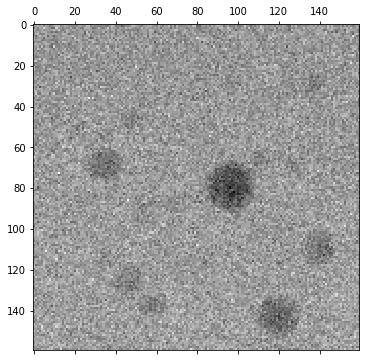
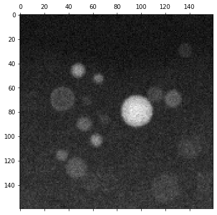

[](https://stempy.readthedocs.io/en/latest/?badge=latest)

Toolkit for processing 4D STEM image data on HPC.

* [Documentation](http://stempy.readthedocs.io/)
  * [Singularity instructions](https://stempy.readthedocs.io/en/latest/singularity.html)
  * [Build instructions](https://stempy.readthedocs.io/en/latest/BUILDING.html)

Example usage
-------------

The following example of creating STEM images can be found
[here](examples/stem_image.ipynb):

```python
import glob
from stempy import io, image
import matplotlib.pyplot as plt

files = glob.glob('/data/4dstem/smallScanningDiffraction/data*.dat')

inner_radii = [0, 40]
outer_radii = [288, 288]

reader = io.reader(files)
imgs = image.create_stem_images(reader, inner_radii, outer_radii, scan_dimensions=(160, 160))

for img in imgs:
    fig,ax=plt.subplots(figsize=(6,6))
    ax.matshow(img, cmap=plt.cm.gray)
    plt.show()
```




